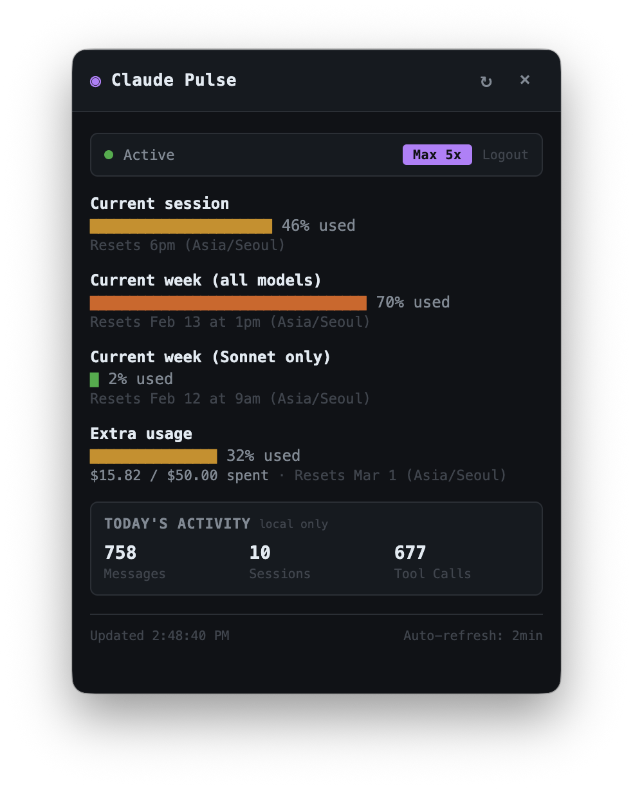

# Claude Pulse

A lightweight menubar/tray app that monitors your [Claude Code](https://docs.anthropic.com/en/docs/claude-code) rate limits in real-time.

<p align="center">
  
</p>

## Features

- **Real-time rate limit monitoring** - Current session (5h), weekly (all models), weekly (Sonnet only), and extra usage with dollar amounts
- **CLI-style progress bars** - Visual utilization bars matching Claude Code's `/limits` output
- **Built-in OAuth login** - No need to have Claude Code installed; authenticate directly from the app
- **Auto-refresh** - Updates every 2 minutes automatically
- **Local activity stats** - Today's messages, sessions, and tool calls computed from local conversation data
- **Menubar/tray app** - Runs quietly in your system tray; click to view, click away to dismiss
- **Cross-platform** - macOS and Windows support

## Installation

Download the latest release from the [Releases page](https://github.com/hulryung/claude-code-pulse/releases).

### macOS

1. Download the `.dmg` file for your Mac:
   - **Apple Silicon** (M1/M2/M3/M4): `Claude Pulse-x.x.x-arm64.dmg`
   - **Intel**: `Claude Pulse-x.x.x.dmg`
2. Open the `.dmg` and drag **Claude Pulse** to the **Applications** folder
3. Launch from Applications (you may need to right-click > Open on first launch)

### Windows

- **Installer**: Download `Claude Pulse Setup x.x.x.exe` and run it
- **Portable** (no install): Download `Claude Pulse x.x.x.exe` and run directly

## Usage

### First Launch

Click the tray icon to open the app. If you already have Claude Code installed and authenticated, the app will use your existing session automatically.

Otherwise, click **Login with Claude** to authenticate via OAuth.

### Right-click Menu

Right-click the tray icon for quick actions: Show, Refresh Now, or Quit.

### Development

```bash
git clone https://github.com/hulryung/claude-code-pulse.git
cd claude-code-pulse
npm install
npm start
```

| Command | Description |
|---------|-------------|
| `npm start` | Launch the app |
| `npm run dev` | Launch with mock data |
| `npm run debug` | Launch with raw API data panel visible |

## How It Works

Claude Pulse calls the Anthropic Usage API (`/api/oauth/usage`) to fetch your current rate limit utilization. This is a read-only endpoint that does **not** consume any API credits.

Local activity stats are computed from Claude Code's conversation logs stored in `~/.claude/projects/`.

## Tech Stack

- **Electron** - Cross-platform desktop framework
- **OAuth 2.0 PKCE** - Secure authentication flow
- **Anthropic Usage API** - Rate limit data source

## Support

If you find this useful, consider buying me a coffee!

<a href="https://www.buymeacoffee.com/hulryung" target="_blank"></a>

## License

MIT
